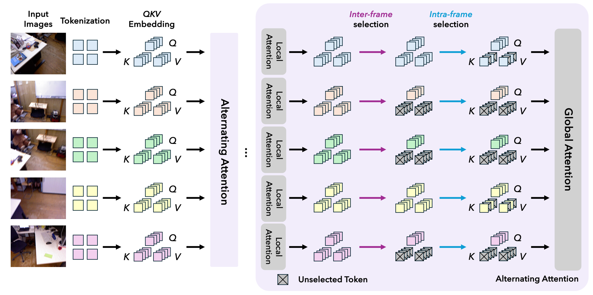

# Good Token Hunting: A Hitchhiker's Guide to Token Selection for Visual Geometry Transformers

## Overview

Our work, *GoToHunt*, speeds up visual geometry transformers by selecting a limited budget of tokens that each query can interact with, that scales near-linearly with the number of input frames.

<p align="center">

</p>


## Environment Setup

Follow the installation instructions at [https://github.com/facebookresearch/map-anything](https://github.com/facebookresearch/map-anything) for environment installation. To make the installation process easier, we could skip the per-model extras if we only run on VGGT and Pi3 as indicated [here](https://github.com/facebookresearch/map-anything#installation-external-model-installation).

---

## Data Preparation

Follow the instructions in [MonST3R](https://github.com/Junyi42/monst3r/blob/main/data/evaluation_script.md) and [Spann3R](https://github.com/HengyiWang/spann3r/blob/main/docs/data_preprocess.md) to prepare 7-Scenes, Neural RGB-D, TUM-Dynamics, and Bonn datasets. The final directory structure will look like the following:

```
data/eval/
├── 7scenes/
│   ├── chess/
│   │   ├── seq-01/
│   │   │   ├── frame-000000.color.png
│   │   │   ├── frame-000000.depth.png
│   │   │   ├── frame-000000.depth.proj.png
│   │   │   ├── frame-000000.pose.txt
│   │   │   └── ...
│   │   └── seq-02/  ...
│   └── fire/  ...
│
├── neural_rgbd/
│   ├── breakfast_room/
│   │   ├── images/                 # img{idx}.png
│   │   ├── depth/                  # depth{idx}.png
│   │   ├── depth_filtered/
│   │   ├── depth_with_noise/
│   │   ├── focal.txt
│   │   └── poses.txt
│   └── complete_kitchen/  ...
│
├── tum/
│   ├── rgbd_dataset_freiburg3_walking_xyz/
│   │   ├── rgb/                  
│   │   ├── depth/                  
│   │   ├── rgb.txt
│   │   ├── depth.txt
│   │   └── groundtruth.txt
│   └── rgbd_dataset_freiburg3_walking_static/  ...
│
└── bonn/
    └── rgbd_bonn_dataset/
        ├── rgbd_bonn_balloon/
        │   ├── rgb/                # *.png
        │   ├── depth/              # *.png
        │   ├── rgb.txt
        │   ├── depth.txt
        │   └── groundtruth.txt     # TUM format
        └── rgbd_bonn_balloon2/  ...  rgbd_bonn_crowd/  ...
```

---


## Covisibility Map Preparation

This step creates the per-scene NxN cosine-similarity matrix for each scene. We compute these
with the global place-recognition descriptor **[MegaLoc](https://github.com/gmberton/MegaLoc)**
using `compute_covisibility.py` in this repo. Note that for the inference time reported in the paper, the runtime for this step has already been included. 

Necessary packages need to be installed as indicated in the **[MegaLoc](https://github.com/gmberton/MegaLoc)** repo.

```bash
# Bonn (5-sequence eval subset)
python compute_covisibility.py \
    --dataset bonn \
    --data_root data/eval/bonn/rgbd_bonn_dataset \
    --output_root /path/to/covisibility/bonn

# 7-Scenes (one matrix per <scene>/seq-XX)
python compute_covisibility.py \
    --dataset 7scenes \
    --data_root data/eval/7scenes \
    --output_root /path/to/covisibility/7scenes

# Neural RGB-D
python compute_covisibility.py \
    --dataset nrgbd \
    --data_root data/eval/neural_rgbd \
    --output_root /path/to/covisibility/nrgbd

# TUM-Dynamics
python compute_covisibility.py \
    --dataset tum \
    --data_root data/eval/tum \
    --output_root /path/to/covisibility/tum
```

The output matrices in `--output_root` are in the following formats:

```
<output_root>/<scene_name>/
├── similarity_matrix.npy   # (N, N) cosine-sim, float32
├── frame_names.txt         # one frame filename per line
└── similarity_matrix.png   # visualization (omit with --no_plot)
```


## Evaluation Scripts

The example command #1: VGGT on 7-Scenes for camera pose estimation:

```bash
python omni_evaluation_code.py \
    --model vggt \
    --dataset 7scenes \
    --data_root /path/to/7scenes/ \
    --frame_strategy diverse \
    --covisibility_root /path/to/covisibility_megaloc/7scenes \
    --frame_topk 25 \
    --kf_every 2 \
    --output_dir /path/to/results \
    --frame_token_downsample 3 \
    --no-frame_include_self \
    --eval_pose \
    --token_ds_layers 2 3 4 5 6 7 8 \
    --global_as_frame_layers 0 1 
```

The example command #2: Pi3 on Bonn for video depth estimation:

```bash
python omni_evaluation_code.py \
    --model pi3 \
    --dataset bonn \
    --data_root /path/to/bonn/rgbd_bonn_dataset/ \
    --frame_strategy diverse \
    --covisibility_root /path/to/covisibility_megaloc/bonn \
    --frame_topk 25 \
    --kf_every 1 \
    --output_dir /path/to/results \
    --frame_token_downsample 3 \
    --no-frame_include_self \
    --eval_depth \
    --token_ds_layers 2 3 4 5 6 7 8 \
    --global_as_frame_layers 0 1 \
    --depth_align scale \
    --resize_mode fixed_width \
    --resize_size 512
```

Detailed explanation on the arguments for customized usage:

| Argument                          | Effect                                                                                                  |
|-----------------------------------|---------------------------------------------------------------------------------------------------------|
| `--model pi3`                     | Choose from `pi3` and `vggt`.                                                                           |
| `--dataset kitti`                 | KITTI depth-selection loader (`image_gathered/` + `groundtruth_depth_gathered/`).                       |
| `--data_root …/val_selection_cropped/` | Root of the KITTI depth dataset.                                                                   |
| `--eval_depth`                    | Specify --eval_depth, --eval_pose, --eval_3d to evaluate on video depth estimation, pose estimation, and 3D reconstruction.|
| `--frame_strategy diverse`        | FPS on the covisibility matrix.                  |
| `--covisibility_root …/kitti`     | Where to load `<scene>/covisibility_matrix.npy`.                           |
| `--frame_topk 25`                 | Each query attends to **K=25** other frames.                                                               |
| `--no-frame_include_self`         | Let every query to attend to the same set of keys.                                                      |
| `--frame_token_downsample 3`      | Stride patch tokens by 3 in both H and W on the selected global-attention layers.                       |
| `--token_ds_layers 2 3 4 5 6 7 8` | Apply token downsampling to global layers 2 to 8. (l_sample = 9)                                                    |
| `--global_as_frame_layers 0 1`    | Replace global attention with local attention in layers 0 and 1. (l_local = 2)                                        |
| `--resize_mode fixed_width --resize_size 512 --depth_align scale` | Parameters specifically for video depth estimation.                     |
| `--output_dir …`                  | Results land under `<output_dir>/pi3/kitti/`.                                                           |

Results are written as JSON files and a TSV summary inside `<output_dir>/<model>/<dataset>/`.


These are the `--data_root` arguments for different datasets:

```bash
--dataset 7scenes   --data_root data/eval/7scenes
--dataset nrgbd     --data_root data/eval/neural_rgbd
--dataset tum       --data_root data/eval/tum
--dataset bonn      --data_root data/eval/bonn/rgbd_bonn_dataset
```

As for 3D reconstruction and depth estimation, the evaluation code used in different prior works has some difference, we follow [ZipMap](https://github.com/Haian-Jin/ZipMap) for video depth estimation, and [StreamVGGT](https://github.com/wzzheng/StreamVGGT) for calculating the evaluation metrics for 3D point cloud estimation. The reason is that in [StreamVGGT](https://github.com/wzzheng/StreamVGGT) implementation, the points used for calculating the metrics are centered cropped from the full images, which can greatly reduce the metrics calculation time for 3D point cloud estimation (though still being a bit long) for a collection of hundreds of images. 

## Acknowledgements

- Thanks to these great repositories: [MapAnything](https://github.com/facebookresearch/map-anything), [CUT3R](https://github.com/CUT3R/CUT3R), [FastVGGT](https://github.com/mystorm16/FastVGGT), [StreamVGGT](https://github.com/wzzheng/StreamVGGT), and many other inspiring works in the community.